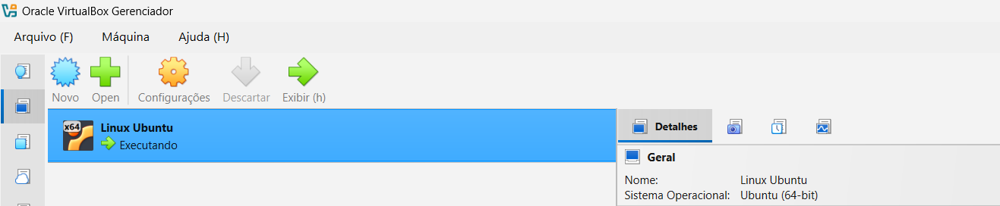
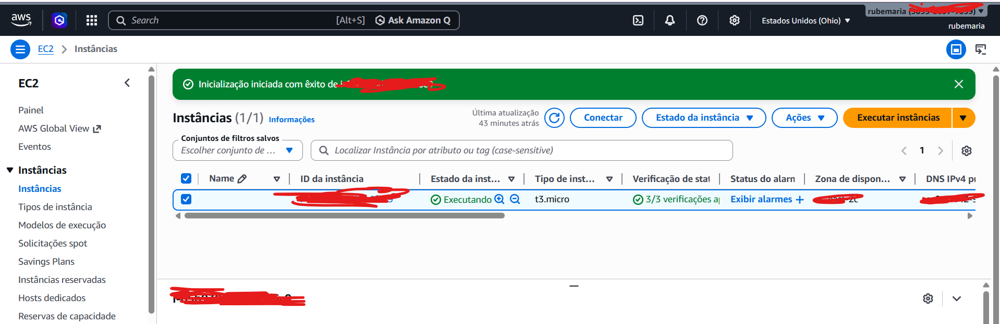
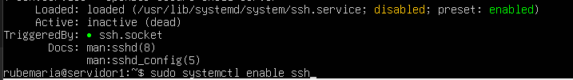
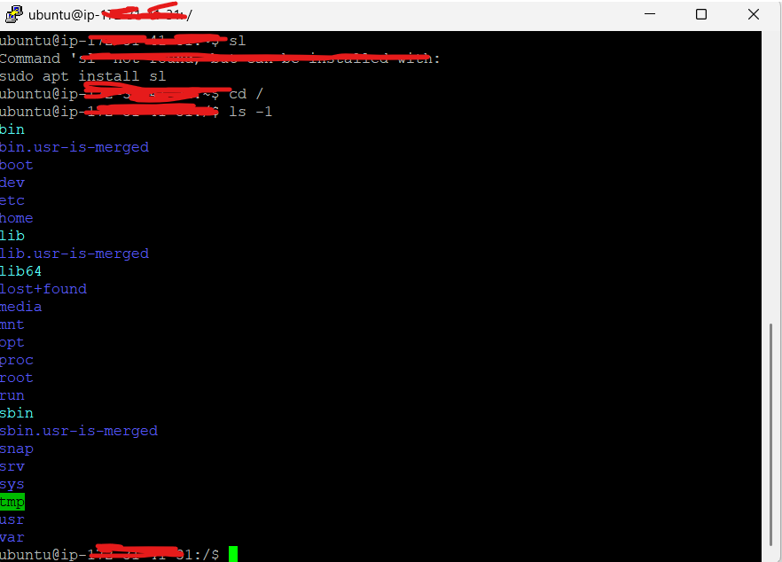

# Laboratórios de Infraestrutura Linux, Acesso Remoto e Computação em Nuvem
### Introdução
Este documento registra a execução de laboratórios práticos envolvendo Linux, virtualização, acesso remoto e computação em nuvem. O objetivo é demonstrar a configuração de ambientes Linux, habilitação de acesso remoto via SSH e utilização de infraestrutura em nuvem utilizando AWS EC2.

## Tecnologias utilizadas
- Linux (Ubuntu Server)
- VirtualBox
- SSH
- PuTTY
- AWS EC2

## Etapas do laboratório
1. Criação de máquina virtual Linux utilizando VirtualBox
2. Instalação do Ubuntu Server
3. Instalação e configuração do serviço SSH
4. Acesso remoto via PuTTY
5. Criação de instância EC2 na AWS
6. Conexão remota à instância utilizando chave SSH

## Arquitetura do laboratório
- Ambiente local com **VirtualBox**
- Máquina virtual **Ubuntu Server**
- Conexão remota via **SSH utilizando PuTTY**
- Instância Linux em **AWS EC2**

## Documentação completa
A documentação detalhada de cada etapa do laboratório pode ser consultada nos seguintes arquivos:

- [Lab 01 — Setup de ambiente Linux no VirtualBox](Lab%2001%20—%20Setup%20de%20ambiente%20Linux%20no%20VirtualBox)
- [Lab 02 — Acesso remoto via PuTTY](Lab%2002%20—%20Acesso%20remoto%20via%20PuTTY)
- [Lab 03 — Instância Linux na AWS](Lab%2003%20—%20Instância%20Linux%20na%20AWS)

## Evidências

### Máquina virtual Linux no VirtualBox

### Instância Ubuntu na AWS EC2

### Serviço SSH no Ubuntu Server

### Acesso remoto via PuTTY

## Aprendizados
Durante o laboratório foram explorados os seguintes conceitos:

- Virtualização de ambientes Linux
- Configuração de serviços SSH
- Acesso remoto seguro
- Uso de autenticação por chave
- Criação e gerenciamento de instâncias em nuvem

## Possíveis melhorias
- Implementar firewall com UFW
- Desabilitar login SSH por senha
- Automatizar criação da infraestrutura
- Monitoramento da instância Linux

